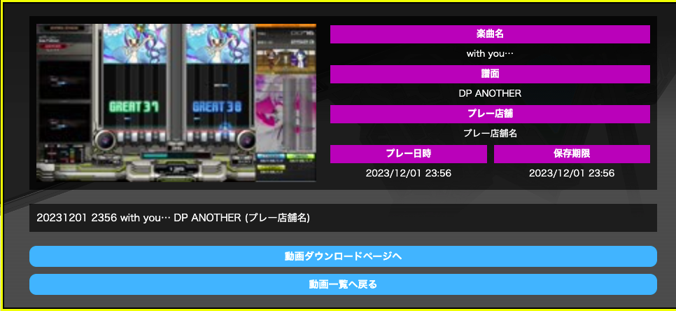

# game2dx.user.js

beatmania IIDX のページで動作する userscript です。

Chrome は [Tampermonkey](https://chrome.google.com/webstore/detail/dhdgffkkebhmkfjojejmpbldmpobfkfo) 、Safari (iOS, macOS) では [Userscripts](https://apps.apple.com/us/app/userscripts/id1463298887) で動作確認をしています。

動作確認対象のページは **31 EPOLIS** です。

以下の機能を実装しています。

## 師弟システムのビンゴカード設定の選択肢を記憶する

師弟システムでビンゴカードを作成する際に指定する、プレースタイル、譜面タイプなどの設定値を一時領域に保存します。  
楽曲表示を行なう際の設定行なわずに済むため、便利になるはずです。

また、設定値はセッショストレージに一時保存しているため、表示しているタブを閉じると設定値はリセットされます。

## プレー録画機能の動画詳細にファイル名用の項目を追加する

プレー録画機能の動画詳細ページにファイル名用の項目を追加します。  
`プレイ日時 楽曲名 譜面 (プレー店舗)` として表示します。参考程度に使ってください。

## 直近でアリーナモードをプレーした人数を表示する

`アリーナクラスTOP RANKER RANKING` に表示されているプレイヤー (上位1000人) のうち、  
直近 (1時間) にプレーした人数をプレイスタイル毎に表示します。
